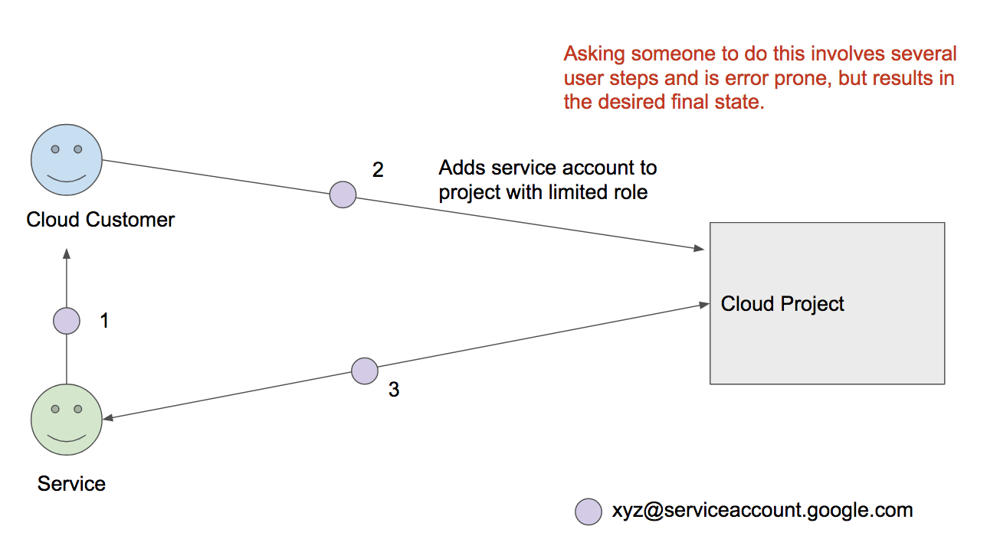

# Addme

An easier way to ask someone to add a service's account to a developer project.

OAuth flows are good for granting access to User owned resources, but don't
work well for Cloud infrastructure projects.

This repo demonstrates how to use the
https://cloud.google.com/shell/docs/open-in-cloud-shell feature to make it easier
to ask someone to grant access to their project for your service.

Try it out (note, for security reasons, this is a nonsense service account, and
will error):

## How to use

 - Fork this repo
 - Edit the 'addme' script to contain your actual service account and desired
   role
 - See the [docs](https://cloud.google.com/shell/docs/open-in-cloud-shell) for
   "Open in Cloud Shell" - you can use a custom button or anchor text that can
   prompt the user for access - it doesn't have to be the blue button above.

THIS IS NOT A GOOGLE PRODUCT
